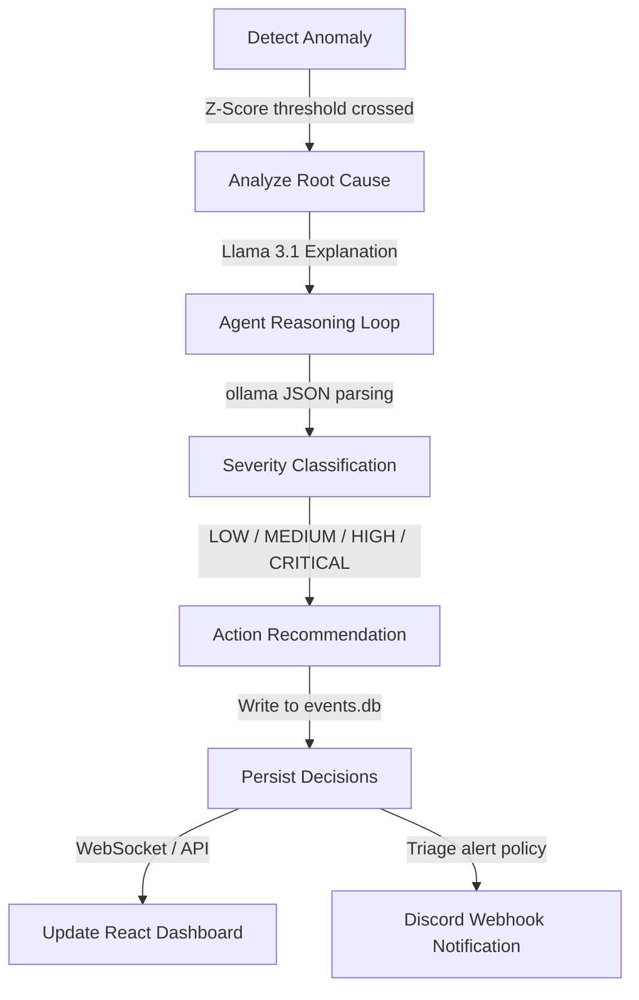

# Streaming Event Anomaly Detector

Real-time transaction anomaly detector equipped with Z-Score statistical thresholds, LLM root cause analysis, an automated SRE Agent reasoning loop, and Discord alerting.

---

## AI Agent Loop

This prototype implements a closed-loop **AI SRE Agent** workflow that automates the triage, classification, and alerting steps whenever statistical anomalies are flagged:



### Steps in the Loop

1. **Detect**: The system monitors the incoming order stream. If the statistical Z-Score crosses the set threshold (default: `±3.0`), an anomaly is declared.
2. **Analyze**: The backend triggers **Llama 3.1** via Ollama to generate a natural language explanation of the spike or drop (the *why* behind the change).
3. **Decide**: The SRE Agent (`ai/agent.py`) takes the raw metric values, the calculated Z-score, and the LLM analysis. Using structured reasoning, it categorizes the severity (`LOW`, `MEDIUM`, `HIGH`, or `CRITICAL`) and triages whether human intervention is required (`requires_alert`).
4. **Recommend**: The Agent formulates a specific, actionable SRE recommendation (e.g., database scaling, rate-limiting, error audits) based on the severity and context.
5. **Persist**: The final decisions are written to the `agent_decisions` table in the SQLite database (`storage/events.db`).
6. **Alert**: If `requires_alert` evaluates to `True` (e.g. for `HIGH` and `CRITICAL` issues), the agent pushes real-time embed alerts directly to a configured Discord channel.
7. **Display**: The React dashboard displays the active decision details (Severity badge, Root Cause analysis, Action recommendation, and Alert status) in the **AI Agent Decision** card.

---

## Running the Project

### Start the Backend Server (FastAPI + AI Thread Loop)
```bash
$env:PYTHONIOENCODING="utf-8"
python -m uvicorn api.server:app --host 0.0.0.0 --port 8000
```

### Start the Frontend Dashboard (React + Vite)
```bash
cd frontend
npm run dev
```
Open [http://localhost:5173/](http://localhost:5173/) to watch the live feed.